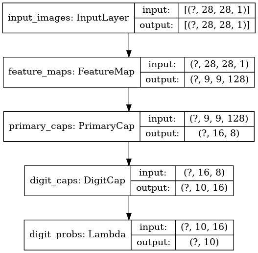

# **EFFICIENT-CAPSNET: CAPSULE NETWORK WITH SELF-ATTENTION ROUTING**  
  


Tensorflow 2.x (with Keras API) Implementation of the Efficient-CapsNet (Mazzia et al., 2021)

# **Training and Testing (MNIST)**  
  
Use
```bash
python main.py --checkpoint_dir=checkpoint --num_epochs=15
```  
- checkpoint: path to save trained weights of the model.
- num_epochs: Number of epochs. You can resume any previous training.
  
You can also simplify  
```bash
python main.py --flagfile=./flags.txt
```

# **Environment (Docker)**
If you use Docker, the code has been verified to work on [tensorflow/tensorflow:2.6.0-gpu][docker-tensorflow-gpu].
- Pull Image & Run container & Get into shell
```bash
docker run -it --rm --runtime=nvidia tensorflow/tensorflow:2.6.0-gpu bash
```
- (In container) Install and Run code
```bash
# Install git
apt-get update
apt-get install git
git clone https://github.com/kaparoo/Efficient-CapsNet.git
cd Efficient-CapsNet

# Install matplotlib
pip install matplotlib

# Training
python main.py --checkpoint_dir=checkpoint --num_epochs=15
```
  
# **References**
- Efficient-CapsNet: Capsule Network with Self-Attention Routing ([arXiv][efficient_capsnet_arxiv_link])
- Official Code ([GitHub][efficient_capsnet_github_link])

[efficient_capsnet_arxiv_link]: https://arxiv.org/abs/2101.12491
[efficient_capsnet_github_link]: https://github.com/EscVM/Efficient-CapsNet
[docker-tensorflow-gpu]: https://hub.docker.com/layers/tensorflow/tensorflow/2.6.0-gpu/images/sha256-e0510bc8ea7dfed3b1381f92891fae3ad5b75712984c3632a60cc164391bca29?context=explore
